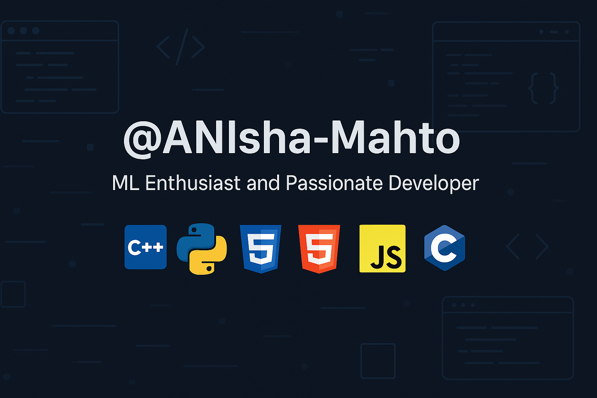

<h1 align="center">
  <marquee behavior="scroll" direction="left" scrollamount="6">
    Hi 👋, I'm Anisha Mahto
  </marquee>
</h1>

<h3 align="center">👨‍💻 Passionate Developer| ML Enthusiast| From 'Hello World!' To Real-World Projects.</h3>

- 🌱 I’m currently learning **Web development and along side doing DSA(c++)**

- 📫 How to reach me **anisha040mahto@gmail.com**

- ⚡ Fun fact **🐛The First Computer Bug Was a Real Bug!**

<h3 align="left">Connect with me:</h3>

<h3 align="left">Languages and Tools:</h3>

            

<h3 align="left">📊 GitHub Stats</h3>

  
  

<h3 align="left">🏆 GitHub Trophies</h3>

  

<!--
**ANIsha-Mahto/ANIsha-Mahto** is a ✨ _special_ ✨ repository because its `README.md` (this file) appears on your GitHub profile.

Here are some ideas to get you started:

- 🔭 I’m currently working on ...
- 🌱 I’m currently learning ...
- 👯 I’m looking to collaborate on ...
- 🤔 I’m looking for help with ...
- 💬 Ask me about ...
- 📫 How to reach me: ...
- 😄 Pronouns: ...
- ⚡ Fun fact: ...
-->
